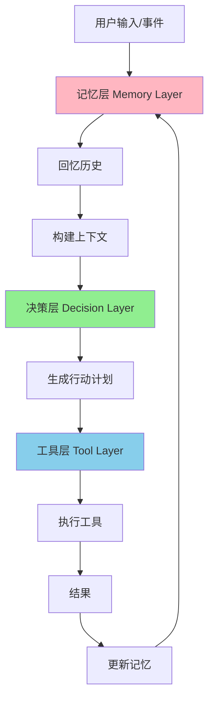

# MCP 三层架构设计（真正的 MCP）

## 问题：简单的工具调用 ≠ 真正的 MCP

你说得对！真正的 MCP 必须有三层：
1. **Memory Layer** - 记忆层
2. **Decision Layer** - 决策层  
3. **Tool Layer** - 工具层

我们之前的设计只有工具层，**缺少记忆和决策**！

---

## MCP 三层架构



---

## Layer 1: 记忆层（Memory Layer）

### 功能
- 记住所有交互历史
- 记住每个联系人的状态
- 记住成功/失败的模式
- 学习什么有效、什么无效

### 实现（LangChain Memory）

```python
from langchain.memory import ConversationBufferMemory, VectorStoreRetrieverMemory
from langchain.vectorstores import FAISS

class CoffeeChatMemory:
    """Coffee Chat 系统的记忆层"""
    def __init__(self):
        # 1. 短期记忆：当前会话
        self.short_term = ConversationBufferMemory(
            memory_key="recent_actions",
            return_messages=True
        )
        
        # 2. 长期记忆：所有历史交互（向量数据库）
        self.long_term = VectorStoreRetrieverMemory(
            vectorstore=FAISS.from_texts([], embedding_function),
            memory_key="historical_patterns"
        )
        
        # 3. 联系人记忆
        self.contact_memory = {}
    
    def remember_interaction(self, contact, action, result):
        """记住一次交互"""
        self.short_term.save_context(
            inputs={"action": action, "contact": contact.name},
            outputs={"result": result}
        )
        
        # 向量数据库存储
        interaction_text = f"Contact: {contact.name}, Action: {action}, Result: {result}"
        self.long_term.save_context({"interaction": interaction_text}, {})
    
    def recall_similar_situations(self, situation):
        """回忆类似情况"""
        return self.long_term.load_memory_variables({"query": situation})
```

---

## Layer 2: 决策层（Decision Layer）

### 功能
- 根据记忆做智能决策
- 判断下一步该做什么
- **判断是否应该放弃（不强求 coffee chat）**
- 学习优化策略

### 实现（crewAI Decision Agent）

```python
from crewai import Agent

class CoffeeChatDecisionAgent:
    """决策 Agent"""
    def __init__(self, memory):
        self.memory = memory
        self.agent = Agent(
            role='Coffee Chat Strategy Decision Maker',
            goal='Decide next action based on history and patterns',
            backstory="""Expert at deciding when to follow up, 
            when to switch strategies, and when to gracefully give up 
            without being pushy."""
        )
    
    def decide_next_action(self, contact):
        """决策下一步"""
        # 1. 回忆历史
        history = self.memory.get_contact_history(contact.id)
        
        # 2. 回忆类似情况
        similar = self.memory.recall_similar_situations(...)
        
        # 3. AI 决策
        decision = self.agent.decide({
            "contact": contact,
            "history": history,
            "similar_cases": similar
        })
        
        return decision


class GracefulGiveUpStrategy:
    """优雅放弃策略（不强求）"""
    @staticmethod
    def should_give_up(contact):
        """判断是否应该放弃"""
        # 规则 1: 2 次 follow-up 无回复
        if contact.followup_count >= 2 and not contact.replied_at:
            return True, "2+ follow-ups ignored"
        
        # 规则 2: Connection 3 周未接受
        if not contact.connection_accepted_at and days_passed > 21:
            return True, "Connection ignored for 3+ weeks"
        
        return False, None
```

---

## Layer 3: 工具层（Tool Layer）

### 功能
- 执行具体操作
- LinkedIn 搜索、发消息
- Apollo 查找邮箱

```python
class CoffeeChatTools:
    """工具层"""
    def linkedin_search(self, params):
        return self.mcp.search(params)
    
    def send_connection(self, contact):
        return self.mcp.send_connection(contact)
    
    def apollo_find_email(self, contact):
        return self.apollo.search(contact)
```

---

## 完整工作流（三层协作）

```python
class CoffeeChatMCPSystem:
    """完整的 MCP 三层系统"""
    def __init__(self):
        self.memory = CoffeeChatMemory()       # Layer 1
        self.decision = CoffeeChatDecisionAgent(self.memory)  # Layer 2
        self.tools = CoffeeChatTools()         # Layer 3
    
    def process_contact(self, contact):
        # 1. 记忆层：回忆历史
        history = self.memory.get_contact_history(contact.id)
        
        # 2. 决策层：决定下一步
        decision = self.decision.decide_next_action(contact)
        
        # 3. 工具层：执行操作
        result = self._execute_action(contact, decision)
        
        # 4. 记忆层：记住结果
        self.memory.remember_interaction(contact, decision, result)
        
        return result
```

---

## 每日自动检查（不需要用户手动）

```python
def daily_check():
    """每天自动检查"""
    system = CoffeeChatMCPSystem()
    
    # 获取需要检查的联系人
    contacts = db.query(CoffeeChatContact).filter(...).all()
    
    for contact in contacts:
        # MCP 三层系统处理
        system.process_contact(contact)
        
        # 随机间隔
        time.sleep(random.uniform(30, 60))
```

---

## 总结：为什么需要三层？

| 层级 | 没有这一层的问题 | 有了这一层的好处 |
|------|---------------|----------------|
| **记忆层** | 每次都是"第一次"，重复犯错 | 学习历史，避免重复错误 |
| **决策层** | 固定规则，不灵活 | 智能决策，优雅放弃 |
| **工具层** | 无法执行操作 | 实际执行任务 |

**真正的 MCP = Memory + Decision + Tools** ✅
